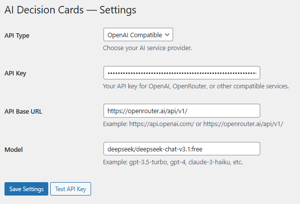
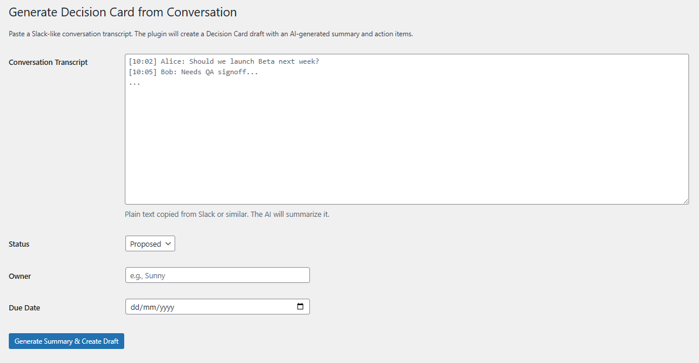
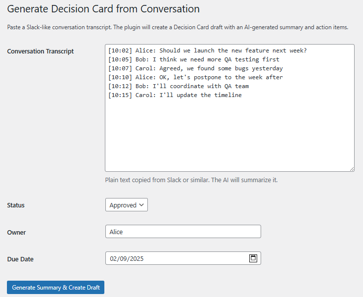
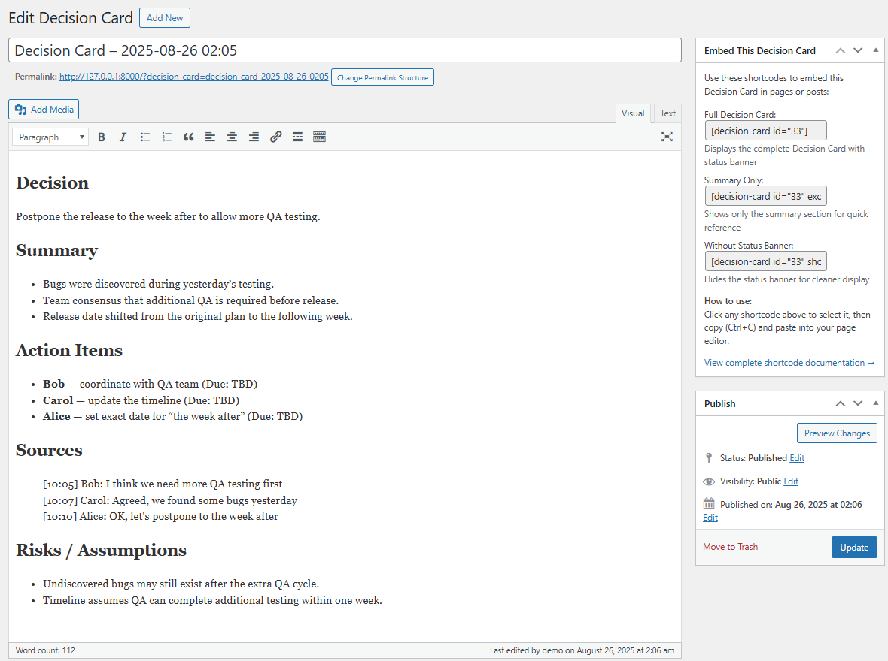
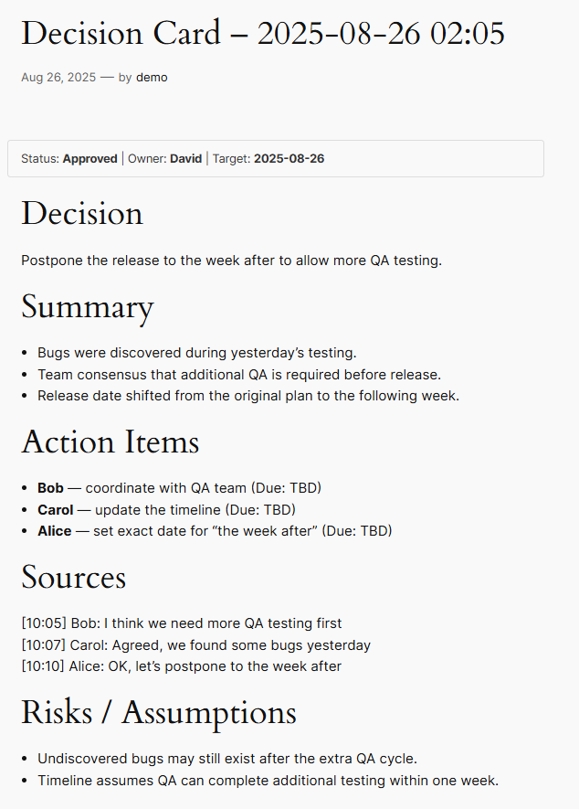
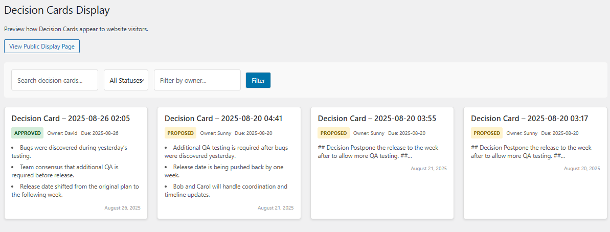
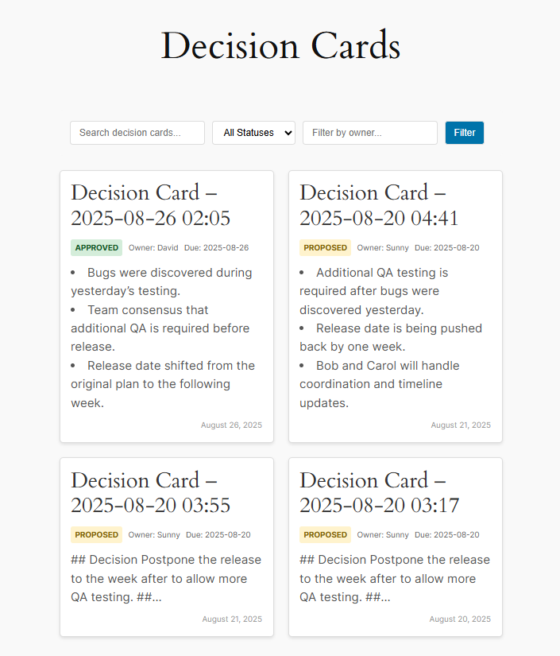
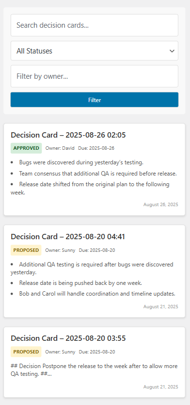
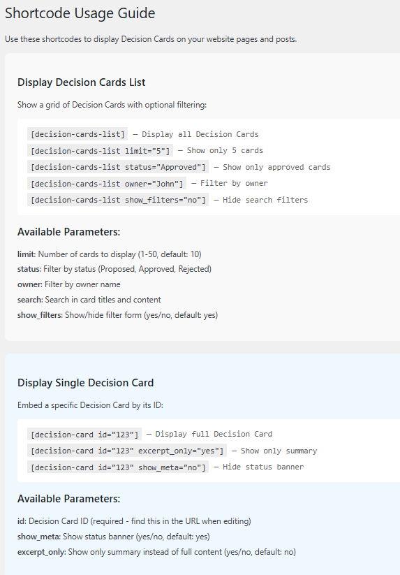

# Slack Conversation to Decision Card Plugin

**Current Version: v1.3.0** | A WordPress plugin that converts Slack-style conversations into AI-generated Decision Cards using OpenAI-compatible APIs.

## 🎯 Project Overview

This project implements a WordPress plugin that helps teams document important decisions by converting Slack conversation transcripts into structured Decision Cards with AI-powered summaries and action items.

## 📁 Project Structure

```
SlackConversation2DecisionCardPlugin/
├── ai-decision-cards/              # Main WordPress plugin directory (v1.3.0 modular architecture)
│   ├── admin/                      # Admin interface classes and views
│   │   ├── class-admin.php         # Main admin class (menus, pages)
│   │   ├── class-admin-ajax.php    # AJAX handlers
│   │   ├── class-admin-assets.php  # Admin asset management
│   │   └── views/                  # Admin view templates
│   │       ├── settings.php        # Settings page template
│   │       ├── generate.php        # Generate Decision Card form
│   │       ├── display.php         # Admin preview display
│   │       ├── shortcodes-guide.php # Shortcode documentation
│   │       └── changelog.php       # Version changelog
│   ├── assets/                     # CSS and JavaScript assets
│   │   ├── css/
│   │   │   ├── admin.css          # Admin styling
│   │   │   └── public.css         # Public/frontend styling
│   │   └── js/
│   │       ├── admin.js           # Admin JavaScript
│   │       └── public.js          # Public JavaScript
│   ├── includes/                   # Core plugin classes
│   │   ├── class-plugin.php        # Main plugin orchestrator (singleton)
│   │   ├── class-cpt.php          # Custom post type registration
│   │   ├── class-ai-client.php    # OpenAI API client
│   │   ├── class-generator.php    # Decision Card generation logic
│   │   ├── class-helpers.php      # Shared utility functions
│   │   ├── class-activator.php    # Plugin activation handler
│   │   ├── class-deactivator.php  # Plugin deactivation handler
│   │   └── class-i18n.php         # Internationalization loader
│   ├── languages/                  # Translation files
│   │   ├── ai-decision-cards.pot  # Translation template
│   │   └── ai-decision-cards-zh_HK.po # Chinese (Hong Kong) translation
│   ├── public/                     # Public/frontend classes and views
│   │   ├── class-public.php        # Public functionality (meta banner, page creation)
│   │   ├── class-public-assets.php # Public asset management
│   │   ├── class-shortcodes.php   # Shortcode rendering
│   │   └── views/                  # Public view templates
│   │       ├── shortcode-list.php  # Decision Cards list display
│   │       └── shortcode-single.php # Single Decision Card display
│   ├── ai-decision-cards.php       # Main plugin file (v1.3.0 bootstrap)
│   ├── readme.md                   # Plugin-specific documentation
│   └── uninstall.php              # Cleanup on plugin removal
├── docs/                          # Project documentation
│   ├── prd.md                     # Product Requirements Document
│   └── todo_list.md               # v1.3.0 modularization plan & progress
├── CLAUDE.md                      # Development guidelines and instructions
├── CLAUDE.local.md               # Local development preferences
├── README.md                     # This file - project overview
└── docker-compose.yml           # Docker development environment
```

## 🚀 Quick Start

### For Users
1. Navigate to the `ai-decision-cards/` directory for the complete WordPress plugin
2. See `ai-decision-cards/readme.md` for installation and usage instructions

### For Developers
1. Review the complete PRD at `docs/prd.md`
2. Check development guidelines in `CLAUDE.md`
3. Follow WordPress plugin development best practices

## 🎯 Key Features

- **🤖 AI-Powered Structured Output**: Converts conversations into fixed 5-section Decision Cards
  - **Decision**: One-sentence summary of what was decided
  - **Summary**: Exactly 3 key bullet points with rationale
  - **Action Items**: Task assignments with intelligent date handling
  - **Sources**: Direct quotes from conversation with timestamps
  - **Risks/Assumptions**: Identified concerns or assumptions
- **📊 Meta Banner**: Visual status display (Status | Owner | Target) at top of each card
- **📅 Smart Date Handling**: Automatically processes relative dates ("next week") with follow-up tasks
- **🎨 Public Display Pages**: Dedicated pages for showcasing Decision Cards to website visitors
- **🔗 Shortcode Support**: Flexible embedding options for pages and posts
  - `[decision-cards-list]` - Display filterable grid with full-text search capability
  - `[decision-card id="123"]` - Embed specific Decision Card
- **📖 Comprehensive User Guidance**: Built-in documentation and copy-paste shortcodes
- **👀 Preview Functionality**: Full preview capability for generated Decision Cards
- **🎛️ Admin Interface**: Simple form-based conversation input with metadata fields
- **🔌 Multiple AI Providers**: Supports OpenAI and OpenAI-compatible APIs (OpenRouter)
- **📝 Draft Workflow**: Generated cards saved as drafts for review and editing

## 📸 Screenshots

### Admin Interface & Configuration

| Settings Configuration | Generate Decision Card |
|------------------------|------------------------|
| <br>*Configure your AI service provider with API keys and model settings* | <br>*Simple form interface for inputting Slack conversations with metadata fields* |

| Enhanced Conversation Input | WordPress Editor View |
|-----------------------------|------------------------|
| <br>*Enhanced conversation input with comprehensive metadata configuration* | <br>*Complete Decision Card in WordPress editor showing the structured 5-section format with embedded shortcode helper* |

### Decision Card Display & User Experience

| Single Decision Card View | Public Display Page |
|---------------------------|---------------------|
| <br>*Frontend view of a complete Decision Card showing the structured 5-section format with meta banner* | <br>*Public-facing Decision Cards display with search and filtering capabilities* |

| Responsive Grid Layout | Mobile-Friendly Display |
|------------------------|-------------------------|
| <br>*Responsive grid layout showing multiple Decision Cards with status indicators* | <br>*Mobile-optimized display ensuring accessibility across all devices* |

### Documentation & User Guidance

| Shortcode Usage Guide |
|-----------------------|
| <br>*Built-in documentation with comprehensive shortcode parameters and examples* |

## 🎉 Latest Updates (v1.3.0 - Current Version)

### v1.3.0
- Refactor: Modular architecture with central `Plugin` orchestrator
- Refactor: Extracted admin/public/generator/helpers into dedicated classes and views
- Refactor: Moved activation/deactivation into `Activator`/`Deactivator`; finalized bootstrap via `plugins_loaded`
- UI: Views cleaned up; assets moved to `assets/`; admin display previews via shortcode
- Fix: Avoid duplicated hooks; shared endpoint helper for OpenAI‑compatible services

### v1.2.1
- Internationalization: Text domain loaded and `.pot` template prepared for translators
- Admin assets: Scoped enqueue of public/admin CSS/JS; expanded localized UI strings
- Public display: Added top-level menu and auto-created public page using `[decision-cards-list]`
- UX: Clearer filters on public display with a Reset link; better query param preservation in forms
- Stability: Extra sanitization and guard checks in request handling

### 🔗 Shortcode & Display Features
- **Comprehensive Shortcode System**: Full embedding support for Decision Cards
  - `[decision-cards-list]` with filtering, pagination, and enhanced full-text search
  - `[decision-card id="123"]` for single card embedding
  - Parameters: `limit`, `status`, `owner`, `search`, `show_meta`, `excerpt_only`
- **🔍 Enhanced Full-Text Search**: Smart search functionality that searches both titles and complete Decision Card content
  - Searches across Decision, Summary, Action Items, Sources, and Risks/Assumptions sections
  - Improved discoverability of decisions based on specific keywords in content
- **Public Display Pages**: Dedicated showcase pages for website visitors
- **User Guidance Integration**: Built-in documentation in Settings page
- **Edit Screen Shortcuts**: Copy-paste shortcodes directly from Decision Card editor
- **Responsive Design**: Mobile-friendly display for all shortcode outputs

### ✨ Previous Major Upgrades (v1.1)
- **Fixed 5-Section Structure**: All Decision Cards now follow consistent format
- **Visual Meta Banner**: Status/Owner/Target display at top of each card
- **Intelligent Date Processing**: Handles "next week", "week after" with automatic follow-ups
- **Preview Capability**: Full preview functionality for generated cards
- **Enhanced AI Prompts**: Improved quality with 600 token limit

### 🔧 Technical Improvements
- **Direct HTML Output**: AI now generates HTML directly instead of Markdown for perfect rendering
- **Advanced Shortcode Engine**: Flexible parameter system with error handling
- **Custom Search Implementation**: Uses WordPress `posts_where` filter for full-text search across titles and content
- **Public Display Infrastructure**: Complete page system with enhanced search and filtering
- **Enhanced User Experience**: Interactive elements and guided workflows
- Enhanced HTML tag support for better formatting
- Public post type visibility for preview functionality
- Improved accessibility with proper contrast ratios

## 📖 Documentation

- **Plugin Documentation**: See `ai-decision-cards/readme.md` for detailed plugin information
- **Product Requirements**: Complete specifications in `docs/prd.md`
- **Development Guidelines**: Project standards and practices in `CLAUDE.md`

## 🛠️ Development

This is a 1-week MVP build following WordPress plugin development standards:

- Direct PHP development (no code generators)
- WordPress coding standards compliance
- Proper error handling and security measures
- Internationalization support

## 📋 Development Commands

- **Linting**: Use WordPress coding standards with PHPCS
- **Testing**: WordPress-specific testing approach (PHPUnit for WordPress)
- **Development**: Edit PHP files directly in the `ai-decision-cards/` directory

## 🔧 Requirements

- WordPress 6.0+
- PHP 7.4+
- Valid OpenAI API key or compatible service
- Internet connection for AI API calls

## 📄 License

GPL v2 or later

---

**Note**: The main plugin files are located in the `ai-decision-cards/` directory. This README provides project-level overview, while plugin-specific documentation is available in `ai-decision-cards/readme.md`.
